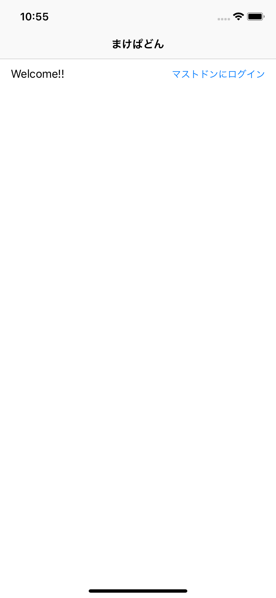
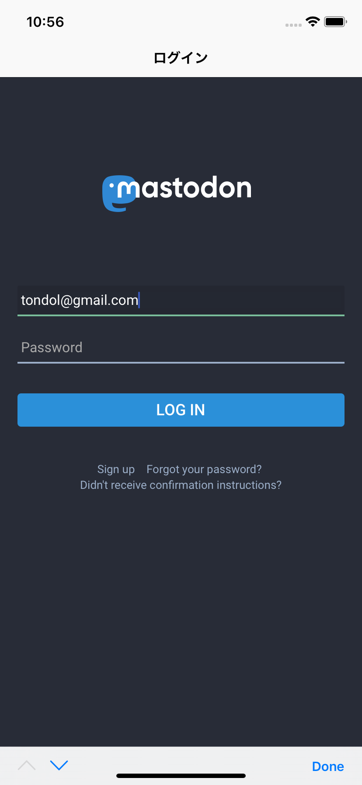
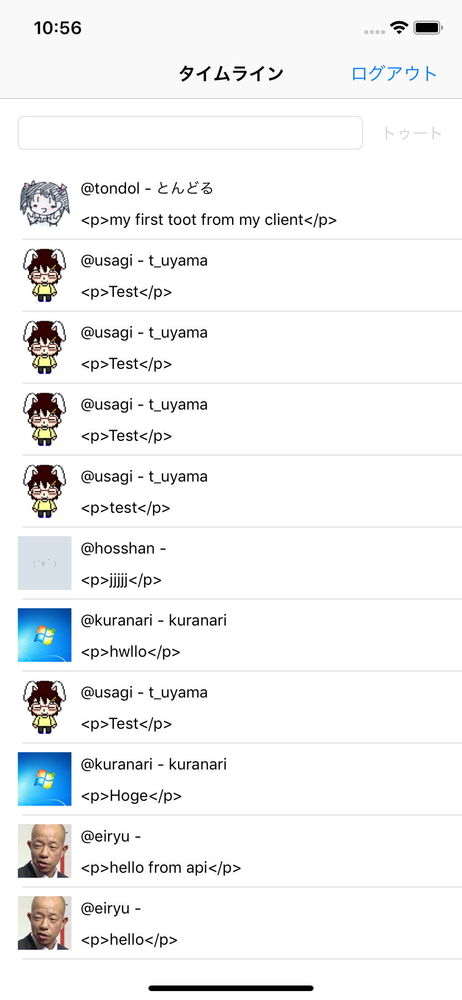

makepadon-client
====

| welcome | sign-in | timeline |
| --- | --- | --- |
|  |  |  |

What is this?
----

This is a Mastodon client app for iOS.

This project is created for a seminar of mobile apps programming.

How to use
----

First of all, you have to register your Mastodon App on your Mastodon instance.
Please remember your `client_id` and `client_secret` after the registration.

Next, please edit your `private.plist` file under the `makepadon-client/Resource` directory.
( `makepadon-client/Resource/private.example.plist` will be helpful for editing.)

You have to fill some fields: `ClientId` , `ClientSecret` , and `MastodonHost` .
`ClientId` and `ClientSecret` are what you got when you registered your app (can you remember?) .
`MastodonHost` is the host of the Mastodon insntance you are using.
`MastodonHost` has the following format: `https://mastodon.example.com` .

To build with Xcode 10, please execute `pod install` in your terminal (this step is required for installing dependencies) .

Dependencies
----

- CocoaPods
- APIKit
- KeychainAccess
- Kingfisher
- RxSwift/RxCocoa

License
----

The MIT License (MIT)
Copyright (c) 2019 tondol <tondol@gmail.com>

Permission is hereby granted, free of charge, to any person obtaining a copy of this software and associated documentation files (the "Software"), to deal in the Software without restriction, including without limitation the rights to use, copy, modify, merge, publish, distribute, sublicense, and/or sell copies of the Software, and to permit persons to whom the Software is furnished to do so, subject to the following conditions:

The above copyright notice and this permission notice shall be included in all copies or substantial portions of the Software.

THE SOFTWARE IS PROVIDED "AS IS", WITHOUT WARRANTY OF ANY KIND, EXPRESS OR IMPLIED, INCLUDING BUT NOT LIMITED TO THE WARRANTIES OF MERCHANTABILITY, FITNESS FOR A PARTICULAR PURPOSE AND NONINFRINGEMENT. IN NO EVENT SHALL THE AUTHORS OR COPYRIGHT HOLDERS BE LIABLE FOR ANY CLAIM, DAMAGES OR OTHER LIABILITY, WHETHER IN AN ACTION OF CONTRACT, TORT OR OTHERWISE, ARISING FROM, OUT OF OR IN CONNECTION WITH THE SOFTWARE OR THE USE OR OTHER DEALINGS IN THE SOFTWARE.
